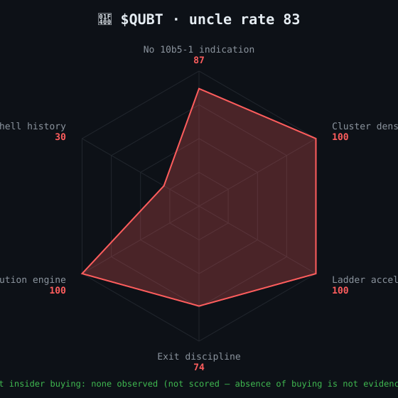
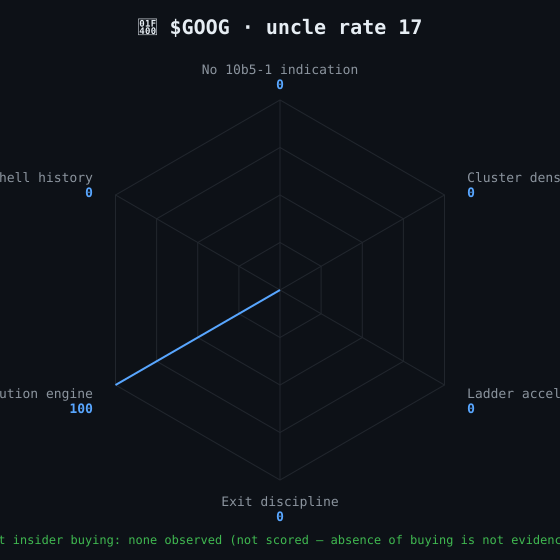

# 🐀 uncle-watch

**Who is selling your stock at the top — and how often they've done it before.**

A former NYSE Vice Chairman joined a quantum-computing company's board in 2021.
In September 2025 he sold 15%, then 41%, then 60%, then 75% of his stake — in four consecutive days, inside a 12% price band, five days before the stock rolled over.

Every number in that sentence is from public SEC filings. Nobody reads them. This tool does.

> Not investment advice. Not an accusation — everything here is legal and disclosed.
> All data is public SEC filings. We just read them. *Someone should.*

## quick start

```
git clone https://github.com/PeachMo16/uncle-watch && cd uncle-watch
node uncle.mjs rate QUBT
```

No dependencies. No API keys. Node 18+ and the SEC's public EDGAR API.

## the four commands

### `uncle rate <TICKER>` — how uncle is this boat?

Downloads every Form 4, splits routine 10b5-1 plan sells from opportunistic sells
(the academic result: routine insider trades carry zero signal, opportunistic ones don't —
Cohen, Malloy & Pomorski, *Decoding Inside Information*, J. Finance 2012),
then scores seven dimensions, each 0–100 with the evidence attached:

| dimension | what it smells for |
|---|---|
| Opportunistic ratio | sells outside pre-scheduled 10b5-1 plans |
| Cluster density | different insiders reaching for the exit in the same week |
| Ladder acceleration | escalating %-of-stake sells day after day |
| Exit discipline | one insider unloading inside a tight price band |
| Net insider flow | do insiders ever buy with their own cash? |
| Dilution engine | shelf registrations and offering supplements |
| Shell history | name changes, fresh 10-12G registrations (reverse-merger tell) |

Composite = weighted average = the **uncle rate**. It also derives the **uncle exit zone**:
the price band where insiders historically pulled the ripcord.

```
🐀 $QUBT · UNCLE RATE 85/100

  Opportunistic ratio   87   20 of 23 sells were outside 10b5-1 plans
  Cluster density      100   3 windows with ≥2 insiders selling within 10 days
  Ladder acceleration   90   one director: 15% → 41% → 60% → 75% of stake in 4 days
  Exit discipline       74   5 sells inside $15.02–$16.88 (12% band)
  Net insider flow     100   ~$33.9M sold vs $0 open-market bought
  Dilution engine      100   27 offering/shelf filings
  Shell history         45   fresh 10-12G registration (reverse-merger fingerprint)

  uncle exit zone: $11.70–$15.62 (median $15.02) · last close $8.92
```

For calibration, the same rubric on a boring mega cap:

```
🐀 $GOOG · UNCLE RATE 25/100

  Opportunistic ratio    0   0 of 308 sells were outside 10b5-1 plans
  Cluster density        0   no multi-insider sell clusters
  Ladder acceleration    0   no accelerating multi-day sell ladders
  Exit discipline        0   no insider with ≥3 opportunistic sells
  Net insider flow     100   ~$205M sold vs $0 open-market bought
  Dilution engine      100   30 offering/shelf filings (mostly bond 424B2s — see limitations)
  Shell history          0   no name changes or fresh registrations on file
```

Three hundred and eight insider sells at Alphabet. Every single one pre-scheduled.
That's what a boring boat looks like.

<p align="center">
   
</p>

### `uncle who <name|CIK>` — one uncle's entire career

Every reporting owner has a personal CIK. Feed it in and get every company
they've ever filed ownership forms on — their whole career of boats:

```
🐀 UNCLE WHO · FAGENSON ROBERT B (CIK 1215183) · 7 boats

  RWY    RENT WAY INC               2003 → 2006    6 filings
  DSS    DOCUMENT SECURITY SYSTEMS  2004 → 2018   27 filings
  TQ     CASH TECHNOLOGIES          2007           1 filing
  NHLD   NATIONAL HOLDINGS          2012 → 2021   16 filings
  QUBT   Quantum Computing Inc.     2021 → 2026    7 filings   sells: 5 tx ~$1,556,005
```

Five boats, all micro caps, one career. The only boat he ever cashed out on
is the one that 40x'd during a hype wave. That list is a fingerprint.

### `uncle actions <TICKER>` — the raw feed

Every insider transaction, newest first, plan sells labeled, opportunistic sells flagged.

### `uncle tickets` — the leaderboard

Every ticker you've rated, sorted by uncle rate, with each boat's loudest dimension.

## honest limitations

- 10b5-1 flags are only reliable after the SEC's 2023 checkbox rule; older opportunistic counts skew high.
- Foreign private issuers (Canadian shells on NASDAQ) are exempt from Form 4 entirely — their uncles are behind the curtain. A SEDI adapter would fix this.
- Multi-owner joint filings are attributed to each owner (slight double-count).
- The weights are hand-tuned on a handful of anchors, not backtested. This is a reading tool, not a trading system.

## vibecoded

This project was built conversationally with an AI agent (Claude) from one person's
observation that the same names kept selling the same stock at the same heights.
Zero dependencies, plain Node, every score traceable to a filing. Fork it, point it at your ticker.

## license

MIT
